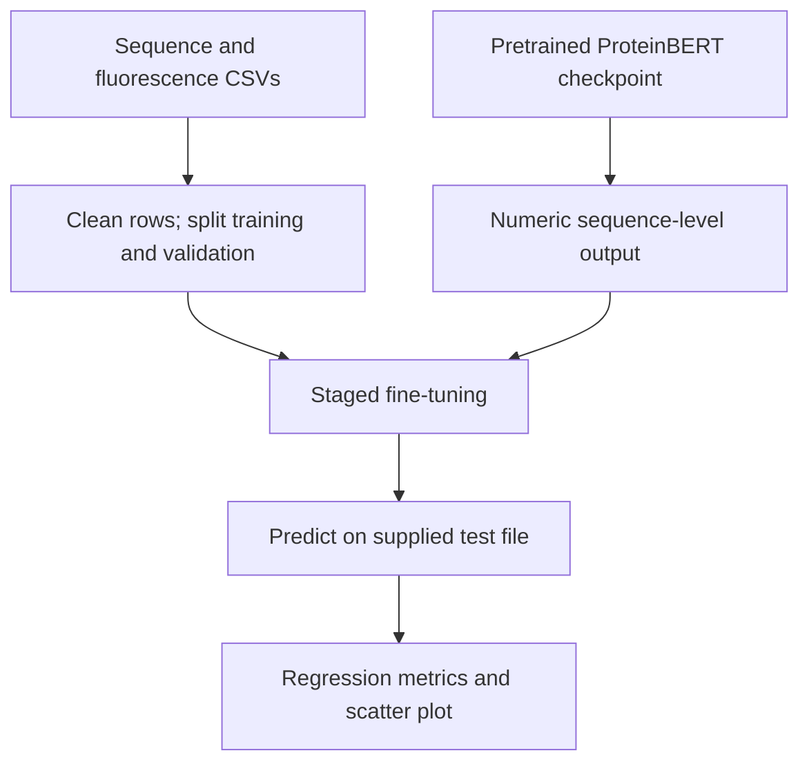
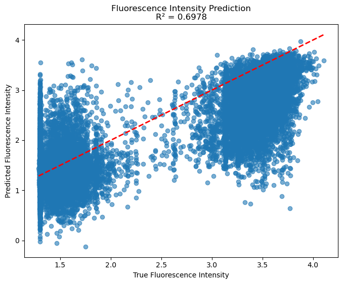

# Protein Fluorescence Prediction with ProteinBERT

Fine-tuning a pretrained protein language model to predict fluorescence from amino-acid sequences, with regression evaluation and an observed-versus-predicted visualization.

**Author:** Zirui Chen  
**Context:** Deep learning coursework (HW9), reorganized as a portfolio project.

This project adapts pretrained **ProteinBERT** to a sequence-level regression task. It uses the existing architecture and weights; it does not introduce or pretrain a new protein language model. The assignment identifies the official signal-peptide fine-tuning demo as a template.

## Start here

- [Main notebook](notebooks/01_proteinbert_fluorescence.ipynb): data processing, model adaptation, staged fine-tuning and evaluation.
- [Data specification](data/README.md): expected CSVs, fields, recorded counts and provenance boundaries.
- [Method notes](docs/method_notes.md): code/log discrepancies, optimizer patch and evaluation limitations.
- [Recorded results](results/README.md): original console output, rounded metrics and prediction preview.

**No training or inference was rerun during this revision.** The figure and scores below are archived coursework outputs, not newly reproduced results.

## Approach



The implementation uses a 90/10 training/validation split, dropout 0.5, frozen-backbone and full-model stages, then a final long-sequence stage. Learning-rate reduction and early stopping are included. The code's learning-rate arguments do not match the displayed training log; [method notes](docs/method_notes.md) distinguish the two rather than asserting an unverified configuration.

## Recorded test performance

| Metric | Original reported value |
| --- | ---: |
| R² | 0.6978 |
| Pearson correlation | 0.8686 |
| RMSE | 0.5355 |
| MAE | 0.3868 |
| MSE | 0.2868 |
| Test records after cleaning | 27,217 |



*Saved plot from the original submission. The dashed line represents exact agreement between predicted and observed values. It is not a fitted trend line.*

The positive correlation supports an association between predictions and observed targets in this run, while RMSE and MAE summarize prediction error on the supplied target scale. R² is **not classification accuracy**, and the reported correlation is Pearson, not Spearman. No confidence intervals or repeated-run estimates were recorded.

### Why there is no confusion matrix

Although the assignment asks for a confusion matrix, this implementation predicts continuous fluorescence. A classification confusion matrix would require an additional, explicitly defined discretization. No bins or thresholds are present in the submission, and the full prediction array was not saved. This repository therefore reports the existing regression metrics and scatter plot without inventing a classification result.

## Data and pretrained model

| Component | Source or status |
| --- | --- |
| Model architecture and implementation | [ProteinBERT official repository](https://github.com/nadavbra/protein_bert) |
| Fine-tuning template named by the assignment | [Official demo notebook](https://github.com/nadavbra/protein_bert/blob/master/ProteinBERT%20demo.ipynb) |
| Local pretrained checkpoint | `epoch_92400_sample_23500000.pkl`; see [model setup](models/README.md) |
| Task inputs | `fluorescence.train.csv` and `fluorescence.test.csv` |
| Exact local CSV lineage | Not documented in the supplied notebook or assignment; raw CSVs not attached |

The model reference does not by itself establish the experimental source of the fluorescence data. The official project links to benchmark files, but the exact local extracts and target transformation have not been verified. See [data provenance](data/README.md).

## Repository contents

| Path | Contents |
| --- | --- |
| `notebooks/` | One main notebook, organized into nine implementation sections |
| `figures/` | Original prediction scatter plot |
| `results/` | Saved metrics, console log and ten-row prediction preview |
| `data/README.md` | Input format and provenance notes |
| `data/raw/` | Local CSV inputs, excluded from Git |
| `models/README.md` | Pretrained checkpoint instructions |
| `docs/method_notes.md` | Method qualifications and editorial changes |
| `requirements.txt` | Dependency inventory, not a locked environment |

## Local use

The archived results can be read without executing the notebook. For a future run:

1. Reconstruct a compatible ProteinBERT/TensorFlow environment using the [upstream installation instructions](https://github.com/nadavbra/protein_bert#installation). The original environment was not recorded; `requirements.txt` is an inventory, not a tested reproduction recipe.
2. Place the authorized original CSVs under `data/raw/` and the trusted pretrained checkpoint under `models/`.
3. Open the notebook from the repository root:

```bash
python -m jupyterlab notebooks/01_proteinbert_fluorescence.ipynb
```

Executing all cells starts fine-tuning. The original Adam monkey patch is retained and modifies the optimizer globally in the kernel; its placeholder state methods do not establish full Keras 3 compatibility. Review the method notes before running. No fine-tuned checkpoint is bundled or exported by the original code.

## Scope and limitations

This project demonstrates adaptation of a pretrained protein model to a numeric prediction task, staged training and regression evaluation. Exact learning rates, package versions and data lineage remain unresolved. The training and test target means differ, and the original workflow does not check sequence overlap or use homology-grouped validation. These results are not a reproduction of the ProteinBERT paper's benchmark scores or evidence of generalization to arbitrary proteins.

## Reference and attribution

Brandes, N., Ofer, D., Peleg, Y., Rappoport, N. & Linial, M. (2022). [ProteinBERT: a universal deep-learning model of protein sequence and function](https://doi.org/10.1093/bioinformatics/btac020). *Bioinformatics*, 38(8), 2102–2110.

Code adapted from Zirui Chen's submitted HW9 notebook, following the coursework task and its reference to the official ProteinBERT demo. Credit for the model architecture, pretraining and upstream library belongs to the ProteinBERT authors. Raw datasets, pretrained weights and the assignment PDF are not redistributed here.
